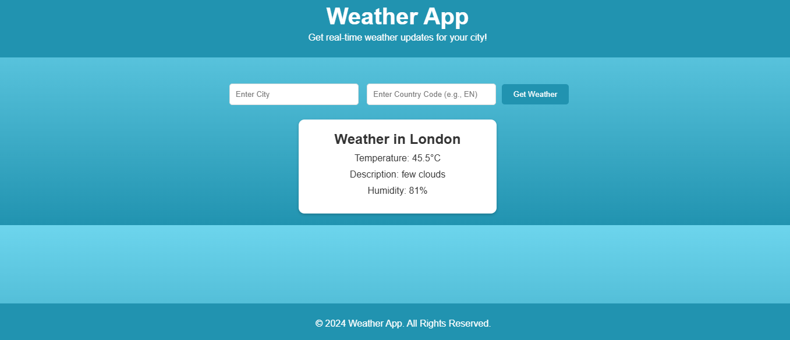

### README.md

```markdown
# Weather App 🌤️

This is a simple weather app built with **FastAPI**, **HTML**, and **CSS**. It allows users to fetch real-time weather data by entering the city name and country code. The app integrates with the [Open Weather API](https://rapidapi.com/worldapi/api/open-weather13) hosted on RapidAPI.

---

## Features
- Fetch real-time weather updates.
- Responsive design with a clean and modern layout.
- Secure API key management using `.env` files.

---

## Prerequisites
1. Python 3.7 or higher.
2. A RapidAPI account with access to the Open Weather API ([Get API Key](https://rapidapi.com/worldapi/api/open-weather13)).
3. Basic knowledge of Python and FastAPI.

---

## Installation Guide

### 1. Clone the Repository
```bash
git clone https://github.com/your-username/weather-app.git
cd weather-app
```

### 2. Create a Virtual Environment
```bash
python -m venv venv
source venv/bin/activate   # On Linux/Mac
venv\Scripts\activate      # On Windows
```

### 3. Install Dependencies
Install the required Python packages:
```bash
pip install -r requirements.txt
```

### 4. Configure the API Key
1. Create a `.env` file in the root directory:
   ```bash
   touch .env
   ```
2. Add your API credentials:
   ```env
   API_HOST=open-weather13.p.rapidapi.com
   API_KEY=your_api_key_here
   ```

### 5. Run the Application
Start the FastAPI development server:
```bash
uvicorn main:app --reload
```
Access the app in your browser at: [http://127.0.0.1:8000](http://127.0.0.1:8000).

---

## Usage Instructions
1. Open the app in your browser.
2. Enter the **city name** and **country code** (e.g., `London` and `EN`).
3. Click the **Get Weather** button.
4. View real-time weather information, including temperature, humidity, and description.

---

## File Structure
```
weather-app/
├── main.py              # FastAPI backend
├── templates/
│   ├── base.html        # Base HTML layout with header & footer
│   ├── index.html       # Weather display page
├── static/
│   ├── styles.css       # CSS file for styling
├── .env                 # Environment variables (not included in the repo)
├── .gitignore           # To exclude .env and unnecessary files
├── requirements.txt     # Python dependencies
```

---

## Deployment (Optional)
You can deploy this app using any platform that supports FastAPI, such as **Heroku**, **AWS**, or **Azure**.

---

## API Reference
- **Base URL**: `https://open-weather13.p.rapidapi.com`
- **Endpoint**: `/city/{city}/{country}`
- **Headers**:
  - `x-rapidapi-host`: `open-weather13.p.rapidapi.com`
  - `x-rapidapi-key`: `<your_api_key>`

Refer to the [Open Weather API documentation](https://rapidapi.com/worldapi/api/open-weather13) for more details.

---

## Contribution
Feel free to fork this repository and create a pull request for any improvements or bug fixes!

---

## License
This project is open-source and available under the [MIT License](LICENSE).

---

### Screenshot

```

### Notes:
1. Replace `"https://github.com/your-username/weather-app.git"` with your actual GitHub repository URL.
2. Replace `"your_api_key_here"` with instructions for users to obtain their API key.
3. Add a `requirements.txt` file with necessary dependencies:
   ```plaintext
   fastapi
   uvicorn
   python-dotenv
   httpx
   jinja2
   ```

4. If possible, add a screenshot (`screenshot.png`) of the app in action for better presentation. 

This **README.md** provides a step-by-step guide for users to set up and run your app!